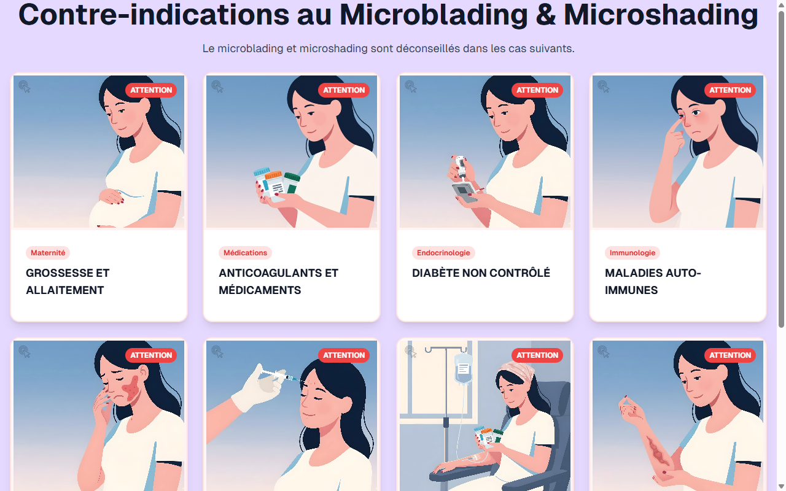

# Contre-indications — Microblading + Microshading

**Course:** MICROBLADING + MICROSHADING  
**Slide:** 6  
**Live URL:** https://contre.edtechiecorp.com  
**Stack:** Next.js · Tailwind CSS · TypeScript · GitHub Pages  

## What this slide does

Displays the contraindications specific to combined microblading and microshading procedures. Covers absolute and relative contraindications including blood-thinning medications, skin conditions like psoriasis or eczema, pregnancy, and autoimmune disorders. The slide helps practitioners identify which clients are unsuitable for treatment before starting the consultation process.

## Screenshot

## Usage

This slide is embedded as an iframe inside Coassemble at the live URL above. DNS is managed via Cloudflare (`edtechiecorp.com`). To update the slide, push to the `main` branch — GitHub Actions will rebuild and redeploy automatically.
